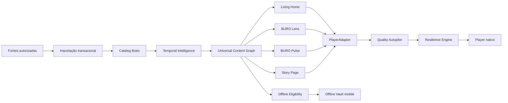

<div align="center">

# IPTV BURO

### Uma plataforma universal de entretenimento para TV, celular, tablet e computador

Transforma fontes de mídia autorizadas pelo usuário em uma biblioteca organizada, cinematográfica, resiliente e, no mobile, disponível offline.


</div>

> [!IMPORTANT]
> O IPTV BURO é exclusivamente um reprodutor e organizador de mídia. O projeto não fornece canais, filmes, séries, playlists, assinaturas ou conteúdo protegido. O usuário deve possuir autorização legal para acessar todas as fontes configuradas.

---

## Visão do produto

O IPTV BURO não foi concebido como apenas mais um player IPTV. O objetivo é transformar fontes desorganizadas em uma experiência premium, rápida e confiável, com identidade própria e aplicações adequadas a cada sistema.

O produto possui seis pilares:

1. **BURO Cinematic System** — interface premium para TV, touch, mouse e teclado.
2. **BURO Catalog Brain** — organização, normalização e deduplicação.
3. **BURO Temporal Intelligence** — lançamentos classificados pelo ano real da obra.
4. **BURO Resilience Engine** — diagnóstico e recuperação controlada de falhas.
5. **Universal Multiplatform Delivery** — o mesmo produto em diferentes ecossistemas.
6. **BURO Offline Vault** — filmes, episódios e temporadas elegíveis offline no mobile.

---

## Estado real do desenvolvimento

Legenda: ✅ concluído · 🧪 em teste · 🚧 em implementação · 🧭 planejado

| Entrega | Estado |
|---|---|
| GDDs 1.0 a 7.0 | ✅ Documentados na `main` |
| Aplicação Android/Android TV | 🧪 Prévia `v0.2.0-alpha.4` |
| Importação local M3U/M3U8 | ✅ Vertical funcional |
| Xtream: ao vivo, filmes, séries e episódios | ✅ Vertical funcional |
| Room, parser em lotes e transação de catálogo | ✅ Implementados |
| Player HLS Media3 | ✅ Vertical funcional |
| BURO Ribbon, Home real, capas e detalhes | 🧪 Fundação cinematográfica em teste |
| Busca, quatro idiomas, perfis e favoritos | 🧪 Implementados; paridade em evolução |
| Temporal Intelligence no código | 🚧 Fileiras 2026/2025; domínio completo pendente |
| Resilience Engine no código | 🧭 Pendente |
| Android mobile | 🧪 Mesma build adaptativa instalada em Android 15 |
| Windows | 🧪 Compose Desktop, player compatível e MSI local aprovados |
| Continuidade de reprodução por perfil | 🧪 Android e Windows implementados; migração Android validada em aparelho físico |
| XMLTV/EPG e Offline Vault autorizado | 🧭 Pendentes |
| Samsung, LG, Titan OS e plataformas Apple | 🧭 Planejados |
| Publicação em lojas | 🧭 Não iniciada |

> [!NOTE]
> Diretório, GDD ou scaffold não significam função pronta. O status só deve avançar com build, testes e validação reproduzível.

---

## Implementação Android atual

A primeira vertical slice está na `main` e possui:

- splash e onboarding legal;
- importação de arquivo M3U/M3U8;
- fontes, categorias e canais persistidos com Room;
- parser streaming com limites e escrita em lotes;
- player HLS com Media3;
- loading, primeiro frame, play/pause e seek quando suportado;
- navegação por D-pad;
- BURO Ribbon;
- Living Home alimentada pelo catálogo real, com lançamentos do ano atual e anterior;
- Xtream com credenciais cifradas pelo Android Keystore;
- capas, backdrop, sinopse, avaliação, elenco, temporadas e episódios quando fornecidos;
- até cinco perfis, inclusive Kids, e favoritos isolados por perfil;
- retrato, paisagem, TV e janelas expandidas;
- controles de volume, brilho, velocidade, bloqueio, PiP, áudio e legenda quando disponíveis;
- PT-BR, inglês, alemão e italiano;
- logs com redaction;
- backup e transferência de dados desabilitados;
- 137 testes aprovados no gate local mais recente e 1 teste conectado de migração aprovado em Android físico;
- lint sem erros bloqueantes;
- build debug aprovada e workflow multiplataforma preparado.

O fluxo importação → categoria → canal → primeiro frame foi validado em aparelho Android físico usando uma playlist HLS pública de teste.

### Prévia para download

- [GitHub Pre-release v0.1.0-alpha.1](https://github.com/lucasserafin94/IPTVBURO/releases/tag/v0.1.0-alpha.1)
- [APK Android/Android TV](https://github.com/lucasserafin94/IPTVBURO/releases/download/v0.1.0-alpha.1/IPTV-BURO-v0.1.0-alpha.1-android-debug.apk)
- arquivo: `IPTV-BURO-v0.1.0-alpha.1-android-debug.apk`
- tamanho: 24.864.542 bytes
- SHA-256: `179537447d53ef062daf9cd100b5ed52416be796ceedb61cb64601a930965dc6`

A prévia usa assinatura de desenvolvimento e não é uma versão de loja.

### Preview multiplataforma v0.2.0-alpha.4

O Windows restaura a fonte via DPAPI e oferece perfis, idiomas, favoritos,
catálogo paginado, detalhes e filmografia na mesma janela, continuidade por
perfil e Home editorial diária. O instalador inclui o VLC oficial para reprodução
H.264/H.265/HEVC, AAC, MP4, MKV e HLS, com play/pause, seek, volume, velocidade e
tela cheia. O botão `Verificar atualização` baixa somente um MSI mais novo do
GitHub Releases e valida o digest SHA-256 antes de executá-lo.

Nesta revisão, o Android usa apenas um painel de controles, altera o volume real
de mídia do aparelho e oferece rotação/tela cheia. A Home separa o ano real de
lançamento da data de entrada na fonte, restaura o hero corretamente com uma
fonte real e mantém os cinco destinos visíveis no celular. No Windows, a versão
fica visível no topo e o player aceita F11, Escape e Espaço além dos controles.

Esta continua sendo uma prévia: download offline depende de autorização explícita
da fonte/backend; HDR forçado, brilho global do monitor e seleção completa de
faixas ainda não são anunciados como funções estáveis.

- [GitHub Pre-release v0.2.0-alpha.4](https://github.com/lucasserafin94/IPTVBURO/releases/tag/v0.2.0-alpha.4)
- [Instalador Windows x64](https://github.com/lucasserafin94/IPTVBURO/releases/download/v0.2.0-alpha.4/IPTVBURO-0.2.3.msi)
- [APK Android/Android TV](https://github.com/lucasserafin94/IPTVBURO/releases/download/v0.2.0-alpha.4/android-tv-debug.apk)
- MSI: 161.352.759 bytes — SHA-256 `2368190AA94FDA53CAF183D3DA715C8D2B1346B750A1800BBDBBC67DED533F2F`;
- APK: 32.288.286 bytes — SHA-256 `6E4A5D53ADF06150F3FF93DEAA05DE1F2BEF8A9ECFDA87015F4CA8B9D6CE5296`.

### Build

Requisitos:

- JDK 17 ou superior;
- Android SDK Platform 36;
- Android Build-Tools 36.0.0;
- Android/Android TV API 23 ou superior.

Windows:

```powershell
.\gradlew.bat test :apps:android-tv:lintDebug :apps:android-tv:assembleDebug :apps:desktop:packageMsi
```

Linux/macOS:

```bash
./gradlew test lint assembleDebug
```

APK local:

```text
apps/android-tv/build/outputs/apk/debug/android-tv-debug.apk
```

MSI local:

```text
apps/desktop/build/compose/binaries/main/msi/IPTVBURO-0.2.3.msi
```

Documentação do estado atual:

- [Implementação atual](docs/status/CURRENT_IMPLEMENTATION.md)
- [Análise de lacunas do GDD 2.0](docs/status/GDD2_GAP_ANALYSIS.md)
- [Arquitetura inicial](docs/adr/ADR-001-initial-architecture.md)
- [Fundação cinematográfica](docs/adr/ADR-002-buro-cinematic-foundation.md)
- [Continuidade de reprodução no Windows](docs/adr/ADR-006-windows-playback-progress.md)
- [Player VLC e atualização segura no Windows](docs/adr/ADR-007-windows-vlc-and-release-updater.md)
- [Tratamento de credenciais](docs/security/credential-handling.md)

---

## Diferenciais planejados

### BURO Temporal Intelligence

Separa:

- data de adição à fonte;
- data real de lançamento.

Um filme antigo adicionado hoje nunca deve aparecer em `Lançamentos {ano atual}`.

### BURO Resilience Engine

Planejado para classificar falhas, limitar retries, proteger snapshots válidos, respeitar conexões simultâneas e explicar erros sem expor dados sensíveis.

### BURO Quality Autopilot

Selecionará estratégia de reprodução considerando aparelho, resolução, HDR, codecs, estabilidade, conexão, idioma e limite de sessões.

### BURO Pulse e BURO Lens

TV ao vivo, mini-guia, zapping, EPG, eventos, busca universal e filtros avançados.

### BURO Offline Vault

Diferencial P0 exclusivo de Android mobile/tablet e iPhone/iPad:

- baixar filme ou episódio elegível;
- baixar temporada como fila de episódios;
- escolher qualidade, áudio e legenda;
- pausar, retomar, cancelar e remover;
- biblioteca acessível sem internet;
- reprodução em modo avião;
- progresso local e sincronização posterior;
- Smart Downloads opt-in;
- Wi-Fi por padrão;
- gerenciamento de armazenamento;
- perfil e Kids também offline;
- conteúdo privado dentro do aplicativo, sem exportação.

A função não será exibida nas aplicações de TV durante o P0.

---

## Plataformas do escopo final

| Plataforma | Estratégia | Estado atual |
|---|---|---|
| Android TV / Google TV | Kotlin, Compose for TV e Media3 | 🧪 Alpha funcional |
| Sony e Philips Android/Google TV | mesma aplicação validada por modelo | 🧭 Pendente |
| Fire TV | variante Android | 🧭 Planejado |
| Android mobile/tablet | Kotlin, Compose e Media3 | 🧪 Preview adaptativo |
| Apple TV | SwiftUI e AVPlayer | 🧭 Planejado |
| iPhone/iPad | SwiftUI, AVFoundation e Offline Vault | 🧭 Planejado |
| macOS | SwiftUI/AppKit e AVPlayer | 🧭 Planejado |
| Samsung Tizen | aplicação própria com AVPlay | 🧭 Planejado |
| LG webOS | aplicação própria | 🧭 Planejado |
| Philips Titan OS | aplicação compatível com SDK oficial | 🧭 Planejado |
| Windows | Compose Desktop; adapter nativo futuro | 🧪 Preview MSI |
| Portal web | ativação, licença e gerenciamento | 🧭 Planejado |

> Um único produto não significa um único executável. Cada plataforma terá player, lifecycle, armazenamento e distribuição adequados ao sistema.

---

## Arquitetura-alvo



Princípios:

- preservar código funcional;
- domínio e regras compartilhados;
- player nativo por plataforma;
- processamento local-first;
- credenciais protegidas;
- snapshots transacionais;
- nenhum spinner ou retry infinito;
- nenhuma função marcada como pronta sem evidência.

---

## Roadmap resumido

### Onda 1 — consolidar Android TV

- completar Cinematic System;
- catálogo real de filmes e séries;
- Temporal Intelligence;
- Xtream e XMLTV/EPG;
- Resilience Engine;
- segurança das fontes;
- testes em Android TV real.

### Onda 2 — Android mobile e Fire TV

- aplicação Android mobile dedicada;
- perfis e sincronização;
- primeira vertical do Offline Vault;
- Fire TV.

### Onda 3 — Apple

- Apple TV;
- iPhone e iPad;
- macOS;
- Offline Vault mobile com AVFoundation.

### Onda 4 — fabricantes e desktop

- Samsung Tizen;
- LG webOS;
- Philips Titan OS;
- Windows;
- portal comercial.

---

## Documentação oficial

- [Índice geral dos GDDs](docs/GDD_IPTV_BURO.md)
- [GDD 2.0 — experiência revolucionária](docs/GDD_2_REVOLUTIONARY_EXPERIENCE.md)
- [GDD 3.0 — inteligência temporal](docs/GDD_3_CATALOG_RELEASE_INTELLIGENCE.md)
- [GDD 4.0 — confiabilidade](docs/GDD_4_RELIABILITY_FAILURE_RECOVERY.md)
- [GDD 5.0 — entrega universal](docs/GDD_5_UNIVERSAL_MULTIPLATFORM_DELIVERY.md)
- [GDD 6.0 — BURO Offline Vault](docs/GDD_6_BURO_OFFLINE_VAULT.md)
- [GDD 7.0 — continuidade e progresso de reprodução](docs/GDD_7_PLAYBACK_CONTINUITY_AND_WATCH_PROGRESS.md)
- [ADR multiplataforma](docs/adr/ADR-0001-MULTIPLATFORM-DELIVERY-ARCHITECTURE.md)
- [Prompt Codex GDD 5](docs/PROMPT_CODEX_CONTINUE_GDD5.md)
- [Prompt Codex GDD 6](docs/PROMPT_CODEX_CONTINUE_GDD6.md)

---

## Ordem para o Codex

1. ler `docs/GDD_IPTV_BURO.md`;
2. ler o relatório de implementação atual;
3. auditar antes de reescrever;
4. preservar builds e migrações;
5. implementar vertical slices pequenas;
6. testar e documentar;
7. separar claramente função pronta de planejamento.

---

## Segurança e modelo comercial

- credenciais não aparecem em logs;
- o projeto não fornece conteúdo;
- não haverá bypass de proteção ou autorização;
- conteúdo offline permanece privado e autorizado;
- teste gratuito proposto: 7 dias;
- compra única proposta: € 9,99 por dispositivo;
- regras finais dependem de validação jurídica, fiscal e das lojas.

<div align="center">

**IPTV BURO — uma experiência, todos os seus aparelhos.**

Projeto privado em desenvolvimento.

</div>
