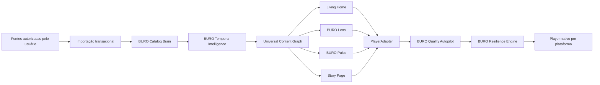

<div align="center">

# IPTV BURO

### Uma nova experiência de entretenimento para TV, celular e computador

Transforme fontes de mídia autorizadas pelo usuário em uma biblioteca organizada, cinematográfica, rápida e resiliente.


</div>

> [!IMPORTANT]
> **O IPTV BURO é exclusivamente um reprodutor e organizador de mídia.** O projeto não fornece canais, filmes, séries, playlists, assinaturas ou conteúdo protegido. Cada usuário é responsável por possuir autorização legal para acessar as fontes configuradas.

---

## Visão do produto

O **IPTV BURO** está sendo projetado para superar a experiência tradicional dos players IPTV. Em vez de apenas exibir categorias e links, o aplicativo deverá transformar uma fonte desorganizada em uma experiência comparável, em acabamento e facilidade de uso, às grandes plataformas modernas de streaming.

O produto combina quatro pilares:

1. **Design cinematográfico** — navegação premium pensada para televisão e controle remoto.
2. **Organização inteligente** — catálogo limpo, deduplicado e classificado corretamente.
3. **Reprodução resiliente** — diagnóstico e recuperação automática de falhas comuns.
4. **Privacidade local-first** — credenciais e processamento sensível preservados no dispositivo sempre que possível.

---

## O problema que o IPTV BURO resolve

Players tradicionais frequentemente apresentam:

- interfaces genéricas e pouco intuitivas;
- categorias duplicadas ou vazias;
- filmes antigos misturados com lançamentos;
- capas, nomes e temporadas desorganizados;
- telas pretas e carregamentos infinitos;
- mensagens de erro genéricas;
- troca lenta de canais;
- dificuldade para avançar conteúdos;
- EPG incorreto ou fora do horário;
- excesso de conexões abertas pelo próprio aplicativo;
- diferenças de compatibilidade entre televisores.

O IPTV BURO trata esses problemas como parte central do produto, não como detalhes posteriores.

---

## Diferenciais principais

### BURO Cinematic System

Sistema visual próprio para criar uma experiência premium:

- **Living Home** contextual e personalizada;
- hero cinematográfico com arte de fundo;
- cards, fileiras e transições desenhados para TV;
- navegação completa por D-pad;
- foco sempre visível e previsível;
- modos gráficos `Eco`, `Balanced` e `Cinematic`;
- redução de movimento e recursos de acessibilidade;
- trailers silenciosos e opcionais;
- Story Page com detalhes completos do conteúdo.

### BURO Catalog Brain

Motor responsável por transformar listas desorganizadas em catálogo:

- normalização de títulos;
- agrupamento de duplicados;
- identificação de filmes, séries, temporadas e episódios;
- associação de capas, sinopses e metadados;
- organização por gênero, idioma, país, qualidade, ano e década;
- correções manuais com prioridade sobre inferências automáticas;
- relatório de integridade da biblioteca.

### BURO Temporal Intelligence

Separa definitivamente duas informações diferentes:

- quando o conteúdo foi adicionado à fonte;
- quando a obra foi realmente lançada.

Isso permite criar fileiras corretas como:

- `Lançamentos {ano atual}`;
- `Adicionados recentemente`;
- `Clássicos que chegaram agora`;
- `Filmes de 2025`;
- `Por década`;
- `Ano desconhecido`.

Um filme antigo adicionado hoje nunca deverá aparecer como lançamento atual.

### BURO Resilience Engine

Sistema central de confiabilidade e recuperação:

- classificação de falhas de rede, servidor, autenticação, formato, codec, decoder, EPG e armazenamento;
- `RetryBudget` para impedir tentativas infinitas;
- `SourceCircuitBreaker` para evitar bombardear fontes instáveis;
- `ConnectionBudgetManager` para respeitar limites de conexões;
- recuperação controlada de playback;
- mensagens compreensíveis para o usuário;
- diagnóstico seguro sem expor URLs completas ou credenciais;
- importação transacional que preserva o último catálogo válido.

### BURO Quality Autopilot

Escolha automática da melhor forma de reprodução considerando:

- capacidade do dispositivo;
- resolução e HDR;
- codec de vídeo e áudio;
- decoder de hardware disponível;
- qualidade da conexão;
- estabilidade anterior da fonte;
- idioma e legenda preferidos;
- limite de conexões simultâneas.

### BURO Pulse

Experiência moderna para TV ao vivo:

- mini-guia sobre o vídeo;
- agora e próximo;
- zapping rápido;
- canal anterior;
- EPG cinematográfico;
- lembretes;
- catch-up quando suportado;
- multiview em dispositivos compatíveis;
- eventos e esportes organizados.

### BURO Lens

Busca universal planejada para localizar conteúdo por:

- nome, ator, diretor ou gênero;
- idioma e país;
- ano ou década;
- duração;
- qualidade e HDR;
- canal ou programa ao vivo;
- consultas naturais como “filme curto de ação em português”.

---

## Recursos do produto

| Área | Recursos planejados |
|---|---|
| **Fontes** | M3U, M3U8, arquivo local, URL remota, Xtream-compatible APIs e XMLTV/EPG |
| **TV ao vivo** | categorias, favoritos, EPG, mini-guia, zapping, catch-up, lembretes e multiview |
| **Filmes** | capas, sinopses, trailers, anos, décadas, gêneros, idiomas, qualidade e continuar assistindo |
| **Séries** | temporadas, episódios, progresso, próximo episódio e novas temporadas |
| **Player** | seek por capacidade real, áudio, legendas, velocidade, HDR, qualidade e diagnóstico |
| **Perfis** | múltiplos usuários, preferências, histórico e recomendações separadas |
| **Kids** | PIN, conteúdo permitido, limites de horário e saída protegida |
| **Sincronização** | progresso, favoritos, perfis, configurações e aparelhos autorizados |
| **Portal web** | ativação, fontes, dispositivos, perfis, organização e backup de configurações |
| **Comercial** | teste de 7 dias e licença vitalícia proposta de € 9,99 por dispositivo |

---

## Plataformas planejadas

| Plataforma | Estratégia | Estado |
|---|---|---|
| **Android TV / Google TV** | Kotlin, Compose for TV e Media3 | 🚧 Primeira implementação |
| **Fire TV** | Base Android adaptada para Fire OS | 🧭 Planejado |
| **Android mobile** | Kotlin e Compose | 🧭 Planejado |
| **iPhone / iPad / Apple TV** | SwiftUI e AVPlayer | 🧭 Planejado |
| **Windows / macOS** | Aplicativo desktop com player nativo/adaptado | 🧭 Planejado |
| **Samsung Tizen** | Aplicação própria com AVPlay | 🧭 Planejado |
| **LG webOS** | Aplicação própria para webOS | 🧭 Planejado |
| **Portal web** | Gerenciamento, ativação e dispositivos | 🧭 Planejado |

---

## Arquitetura-alvo



### Princípios arquiteturais

- domínio e contratos compartilhados;
- player nativo ou adaptador específico por plataforma;
- processamento local-first;
- banco local com migrações seguras;
- nenhuma atualização substitui um snapshot válido por dados vazios ou corrompidos;
- nenhuma falha pode gerar spinner ou retry infinito;
- nenhum log pode revelar credenciais;
- desempenho e navegação por controle remoto são requisitos de produto.

---

## Estado real do desenvolvimento

Legenda: ✅ concluído · 🚧 em andamento · 🧭 planejado

| Entrega | Estado |
|---|---|
| Visão do produto e modelo comercial | ✅ Documentado |
| Arquitetura técnica multiplataforma | ✅ Documentada |
| Especificação GDD 1.0 — fundação técnica | ✅ Documentada |
| Especificação GDD 2.0 — experiência cinematográfica | ✅ Documentada |
| Especificação GDD 3.0 — inteligência temporal | ✅ Documentada |
| Especificação GDD 4.0 — confiabilidade e recuperação | ✅ Documentada |
| Prompts incrementais para o Codex | ✅ Concluídos |
| Fundação Android TV | ✅ Vertical local funcional e validada |
| BURO Cinematic Foundation | 🚧 Primeira milestone implementada; GDD 2.0 parcial |
| Player e importação de fontes | ✅ Vertical local validada de ponta a ponta |
| Portal web e licenciamento | 🧭 Planejado |
| Aplicativos para outras plataformas | 🧭 Planejados |
| Versão pública | 🧭 Ainda não lançada |

> [!NOTE]
> A especificação oficial permanece versionada em `main`. O código só é
> marcado como implementado depois de build, testes e validação reproduzível.

---

## Implementação Android atual

Versão em desenvolvimento: `0.1.0-alpha.1`.

O primeiro vertical slice inclui:

- splash e onboarding legal;
- importação local de M3U/M3U8;
- fontes, categorias e canais persistidos com Room;
- player HLS com Media3;
- controles de seek apenas quando a mídia permite;
- BURO Ribbon com Início, Ao Vivo, Filmes, Séries, Descobrir, Minha BURO,
  Pesquisa e Perfil;
- Living Home com hero, fileiras sintéticas marcadas como DEMO e uma fileira
  separada para fontes reais, sem URLs na camada visual;
- Story demonstrativa sem playback e placeholders explícitos para destinos que
  ainda não possuem funcionalidade real;
- design system com tokens semânticos, tiers
  `Auto`/`Eco`/`Balanced`/`Cinematic`, reduced motion, high contrast e reduced
  transparency;
- restauração mínima do foco da Home e comportamento `Back → Ribbon`;
- Configurações acessíveis pelo Perfil;
- navegação por D-pad;
- PT-BR, inglês, alemão e italiano;
- logs com redaction de dados sensíveis;
- 55 testes JVM aprovados, lint sem erros, build debug e CI configurada.

O fluxo E2E foi validado no Redmi A5 com Android 15 usando a playlist HLS
pública Apple BipBop: importação, navegação até o canal, primeiro frame e
áudio/vídeo sem crash.

Esta implementação ainda está no workspace, sem commit, push ou GitHub Release.
Os tokens novos ainda não cobrem integralmente a Home e as telas legadas.
Também permanecem pendentes testes instrumentados/golden, Busca e Perfis reais,
catálogo de Filmes e Séries, Xtream, XMLTV/EPG, GDD 3.0, GDD 4.0 e proteção das
URLs de stream atualmente armazenadas em texto simples no Room. Licença, portal,
aplicativos mobile dedicados e desktop continuam em milestones posteriores.

### Requisitos de desenvolvimento

- JDK 17 ou superior;
- Android SDK Platform 36;
- Android SDK Build-Tools 36.0.0;
- dispositivo Android/Android TV 6.0 (API 23) ou superior.

O Gradle Wrapper já faz parte do repositório.

### Build e testes

No Windows:

```powershell
.\gradlew.bat test lint assembleDebug
```

No Linux/macOS:

```bash
./gradlew test lint assembleDebug
```

O APK debug é gerado em:

```text
apps/android-tv/build/outputs/apk/debug/android-tv-debug.apk
```

### Instalar por ADB

```powershell
& "$env:LOCALAPPDATA\Android\Sdk\platform-tools\adb.exe" install -r `
  "apps\android-tv\build\outputs\apk\debug\android-tv-debug.apk"

& "$env:LOCALAPPDATA\Android\Sdk\platform-tools\adb.exe" shell am start `
  -n com.lucasserafin94.iptvburo.debug/com.lucasserafin94.iptvburo.MainActivity
```

### Download

Quando a primeira prévia for publicada, o APK ficará em
[GitHub Releases](https://github.com/lucasserafin94/IPTVBURO/releases).

A prévia inicial usa assinatura de desenvolvimento. Veja a
[política da primeira versão](docs/release/first-release.md).

### Estrutura do código

```text
apps/android-tv
  ├─ Compose for TV e navegação D-pad
  ├─ ViewModel, Room, DataStore e Hilt
  └─ Media3 e OkHttp

packages/domain-model
packages/playlist-parser
packages/test-fixtures
```

Estado detalhado:

- [implementação atual](docs/status/CURRENT_IMPLEMENTATION.md);
- [análise de lacunas do GDD 2.0](docs/status/GDD2_GAP_ANALYSIS.md);
- [arquitetura inicial](docs/adr/ADR-001-initial-architecture.md);
- [fundação cinematográfica](docs/adr/ADR-002-buro-cinematic-foundation.md);
- [tratamento de credenciais](docs/security/credential-handling.md).

---

## Roadmap resumido

### Fase 1 — Fundação Android TV

- estrutura do projeto;
- navegação por D-pad;
- design tokens e BURO Cinematic System;
- banco local;
- importação M3U/Xtream/XMLTV;
- player Media3;
- logs seguros, testes e CI.

### Fase 2 — Catálogo premium

- Living Home;
- Story Page;
- filmes, séries e episódios;
- BURO Catalog Brain;
- BURO Temporal Intelligence;
- busca e filtros;
- perfis e continuar assistindo.

### Fase 3 — Confiabilidade

- BURO Resilience Engine;
- classificação normalizada de falhas;
- retry controlado e circuit breaker;
- orçamento de conexões;
- importação transacional;
- Failure Test Lab;
- compatibilidade por modelo de TV.

### Fase 4 — Produto comercial

- teste gratuito;
- licença por dispositivo;
- portal web;
- ativação e gerenciamento de aparelhos;
- sincronização segura;
- publicação e telemetria com privacidade.

### Fase 5 — Expansão

- Android mobile e Fire TV;
- Apple TV e iOS;
- Windows e macOS;
- Samsung Tizen;
- LG webOS;
- companion mobile e controle remoto.

---

## Documentação oficial

### Índice geral

- [GDD / PRD completo](docs/GDD_IPTV_BURO.md)

### GDDs

- [GDD 2.0 — Revolutionary Entertainment Experience](docs/GDD_2_REVOLUTIONARY_EXPERIENCE.md)
- [GDD 3.0 — Catalog Intelligence & Release Integrity](docs/GDD_3_CATALOG_RELEASE_INTELLIGENCE.md)
- [GDD 4.0 — Reliability, Failure Recovery & Playback Integrity](docs/GDD_4_RELIABILITY_FAILURE_RECOVERY.md)

### Prompts para o Codex

- [Prompt mestre — fundação inicial](docs/PROMPT_MESTRE_CODEX_IPTV_BURO.md)
- [Continuação com GDD 2.0](docs/PROMPT_CODEX_CONTINUE_GDD2.md)
- [Continuação com GDD 3.0](docs/PROMPT_CODEX_CONTINUE_GDD3.md)
- [Continuação com GDD 4.0](docs/PROMPT_CODEX_CONTINUE_GDD4.md)

---

## Ordem obrigatória para desenvolvimento com Codex

O Codex deve:

1. ler `docs/GDD_IPTV_BURO.md`;
2. ler todos os capítulos do GDD 1.0;
3. ler o GDD 2.0 e `docs/gdd-v2/`;
4. ler o GDD 3.0;
5. ler o GDD 4.0 e `docs/gdd-v4/`;
6. auditar o código existente antes de reescrever qualquer componente;
7. implementar em commits pequenos e verificáveis;
8. manter build, testes e documentação atualizados;
9. nunca marcar uma função como concluída sem implementação e validação reproduzível.

---

## Segurança, privacidade e legalidade

- credenciais nunca devem aparecer em logs;
- URLs completas e tokens devem ser redigidos;
- o backend não deve armazenar playlists privadas desnecessariamente;
- o projeto não implementará bypass de DRM, autorização, certificados ou bloqueios contratuais;
- fontes ilegais ou não autorizadas não fazem parte do produto;
- o usuário controla suas fontes, dispositivos e dados;
- diagnósticos exportados devem ser seguros e anônimos por padrão.

---

## Situação comercial proposta

- **teste gratuito:** 7 dias;
- **licença:** compra única por dispositivo;
- **preço-alvo inicial:** € 9,99;
- **conteúdo:** nunca incluído;
- **ativação:** aplicativo + portal web;
- **expansão:** pagamentos e regras adaptados às lojas de cada plataforma.

O modelo comercial ainda deverá passar por validação jurídica, fiscal, técnica e pelas políticas das lojas antes do lançamento.

---

<div align="center">

### IPTV BURO

**Organização inteligente. Experiência cinematográfica. Reprodução confiável.**

Projeto privado em desenvolvimento.

</div>
